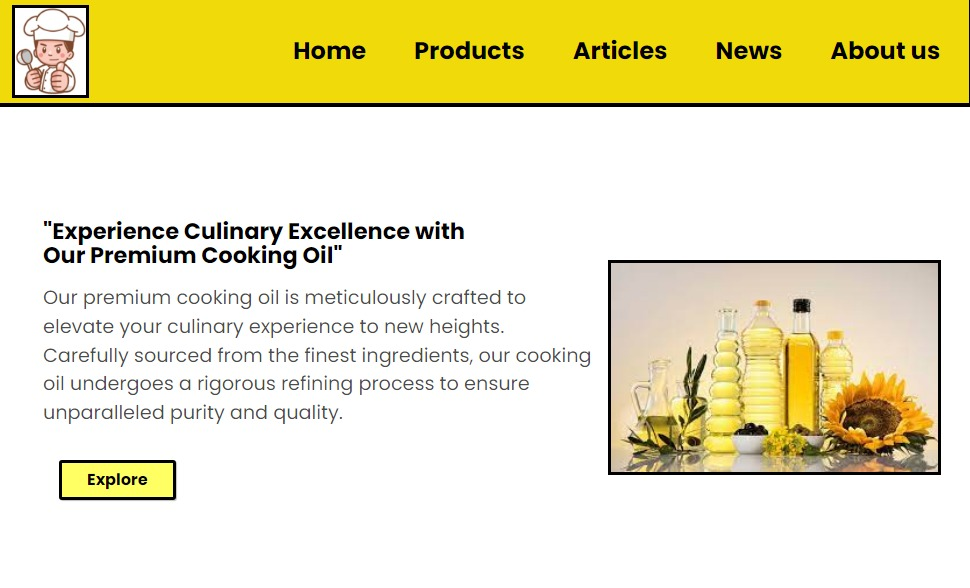
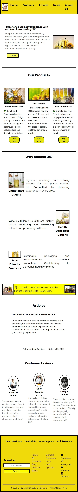
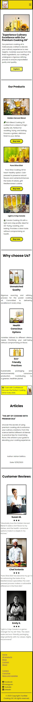

<a name="readme-top"></a>

# Project Title

<h1 align="center">Sunbee Cooking Oil Landing Page</h1>

### Screenshot





## Description

This is landing page for a cooking oil company. This is also my practical project on making real world applications/website.

### Created with the use of the following:

    - VS Code for the text editor.
    - Live Server the the extension.
    - HTML for the structure.
    - CSS for design.

## Getting Started

Hi wanna copy this site? Here's what you need

- a Browser any kind.
- Text Editor or an IDE.
- Live Server

You can open the index.html using any browser. i also use live server to see the live update everytime i save when there's changes on the code.

### Installing

1. No additional modifications are needed; you're ready to use it! after installing it on the hosting site
1. Follow the installation instructions based on your Hosting services.

### Executing program

To run the project, follow these steps after forking:

1. Open your terminal or command prompt.
2. Navigate to the directory where you want to use the project.
3. type ```bash
   git clone "project link"
4. Start making commits to track changes:

   ```bash
   git add .
   git commit -m "Your commit message here"
   ```

<p align="right">(<a href="#readme-top">back to top</a>)</p>

### Live Demo

Explore the live demo [here](https://frogerall.github.io/tribute-page/).

## Future Plans

- Add to cart functionality
- Dedicated About Page
- Contact us Page
- Food Recipe Page

Lastly is the Article Page.

## Contributions

Want to contribute? sure that will be great!. You can inbox me on my Linkedin or just fork and submit a pull request it is very much appreciated 🙌.

## Help

If you encounter common problems or issues while using this project you can directly inbox me on my email below.

## Authors

**Author:**

You can reach out to me for suggestions, comments, or just to chat:

- Adrian Salitico
  - GitHub: https://github.com/frogerall
  - LinkedIn: https://linkedin.com/in/nairda4
  - Email: saliticoadrian@gmail.com

<p align="right">(<a href="#readme-top">back to top</a>)</p>
